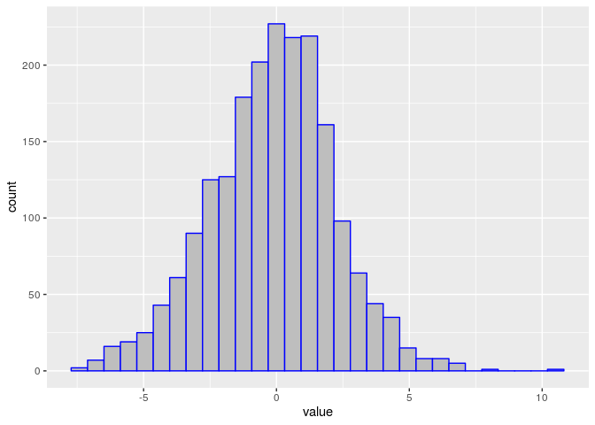
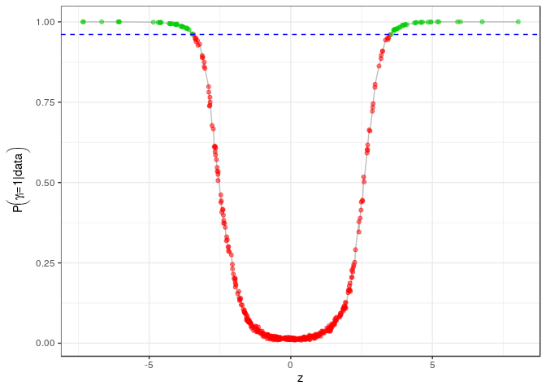

## Two-group Poisson-Dirichlet mixtures for multiple testing
## Tutorial 

In this tutorial we apply our methodology to a subsample of the `golub` dataset, which can be found in the `multtest` package. The package can be installed and loaded with the following lines:


```r
source("https://bioconductor.org/biocLite.R")
biocLite("multtest")
require(multtest)
```

Let's take a look to the dataset: the golub table contains gene expression values from 3051 genes taken from 38 Leukemia patients. Twenty seven patients are diagnosed as acute lymphoblastic leukemia (ALL) and eleven as acute myeloid leukemia (AML). ([R Basics using Golub Data](https://rstudio-pubs-static.s3.amazonaws.com/187747_3eb3fc30ad7f4d8e92ad73520a0ff8f5.html)) 


```r
data(golub)
```

```r
head(golub[,1:7])
```

```
##          [,1]     [,2]     [,3]     [,4]     [,5]     [,6]     [,7]
## [1,] -1.45769 -1.39420 -1.42779 -1.40715 -1.42668 -1.21719 -1.37386
## [2,] -0.75161 -1.26278 -0.09052 -0.99596 -1.24245 -0.69242 -1.37386
## [3,]  0.45695 -0.09654  0.90325 -0.07194  0.03232  0.09713 -0.11978
## [4,]  3.13533  0.21415  2.08754  2.23467  0.93811  2.24089  3.36576
## [5,]  2.76569 -1.27045  1.60433  1.53182  1.63728  1.85697  3.01847
## [6,]  2.64342  1.01416  1.70477  1.63845 -0.36075  1.73451  3.36576
```

After extracting a subsample fromt the dataset, we compute the z-scores for the gene expressions.


```r
teststat = mt.teststat(golub, golub.cl)
set.seed(1234)
index <- sample(length(teststat),size = 2000)
Z     <- teststat[index]
names <- golub.gnames[index, 2]
TT    <- tibble::enframe(Z,name = NULL)
ggplot(TT)+geom_histogram(aes(x=value),col=4,fill="gray")
```

<!-- -->

We are now ready to apply the BNPTesting model. Let's set up the hyperpriors values...


```r
prior_par11 <- list(m0=0,   s0=1, 
                    m1=3,   V1=3, 
                    a1= 1, b1=1, 
                    a_rho=1,  b_rho=9,
                    theta0=1, theta1=1, 
                    sigma0=0.75, sigma1=0.1, # parameters of the process
                    a_0 = 5, b_0 = .2,
                    kappaNLP=3, s1=2)
```

...and run the model!


```r
res1 <- BNPtesting(NSIM = 10000, 
                  burn_in = 10000, 
                  thinning = 1, 
                  y= Z, 
                  prior_par = prior_par11, 
                  verbose = T,
                  verbose_step = 10, 
                  sed = i*100,
                  SM = .5,optThresh = .44,batch = 100) 
```

The model provides a list as output, containing the following elements:

+ ``Y``: the data 
+ ``prior_par``: the hyperparameters' values
+ ``m1con``: MCMC chain for the parameter $m_1$
+ ``LabCon``: $MCMC chain for the cluster membership of each observation (inside the respective process)
+ ``Rhocon``: MCMC chain for the parameter $\rho$
+ ``ZiCon``: MCMC chain for the indicator variable $\gamma_i$
+ ``Thetacon``: MCMC chain for $\vartheta_i$

The output class is `BNPTesing`.

For example:

```r
qplot(y=res1$RhoCon,x=1:10000, geom = "line")+theme_bw()
```

<!-- -->

The most interesting part is the Posterior Probaiblity of Inclusion in the alternative process (PPI). We classify each observation as relevant if its PPI is above a specified threshold. We choose the threshold controlling the Bayesian FDR (Newton, 2004). We can visualize the results using the `plot` function defined for the `BNPTesing` class. We finally derive the ranking of the relevant genes.


```r
plot(res1,TH=.01)
```


<!-- -->

```r
Ranking(res1,names = names,TH = .01)
```


|   |Observation                                                                                                                                   |    PPI|
|:--|:---------------------------------------------------------------------------------------------------------------------------------------------|------:|
|4  |THBD gene extracted from Human thrombomodulin gene                                                                                            | 1.0000|
|9  |KERATIN, TYPE II CYTOSKELETAL 6D                                                                                                              | 1.0000|
|20 |Homolog of yeast IPP isomerase                                                                                                                | 1.0000|
|37 |Lamin B gene extracted from Human lamin B mRNA                                                                                                | 1.0000|
|39 |EVPL Envoplakin                                                                                                                               | 1.0000|
|42 |JTV-1 (JTV-1) mRNA                                                                                                                            | 1.0000|
|44 |FAU Finkel-Biskis-Reilly murine sarcoma virus (FBR-MuSV) ubiquitously expressed (fox derived)                                                 | 1.0000|
|54 |CANX Calnexin                                                                                                                                 | 1.0000|
|56 |UBE1 Ubiquitin activating enzyme E1                                                                                                           | 1.0000|
|64 |Clone 161455 breast expressed mRNA from chromosome X                                                                                          | 1.0000|
|48 |GB DEF = Selenium-binding protein (hSBP) mRNA                                                                                                 | 0.9999|
|63 |Ionotropic ATP receptor P2X5a mRNA                                                                                                            | 0.9999|
|30 |GB DEF = Lymphocyte-specific protein 1 (LSP1) mRNA                                                                                            | 0.9997|
|21 |KIAA0272 gene, partial cds                                                                                                                    | 0.9996|
|26 |ARF6 ADP-ribosylation factor 6                                                                                                                | 0.9991|
|61 |IGB Immunoglobulin-associated beta (B29)                                                                                                      | 0.9991|
|55 |Rhodanese                                                                                                                                     | 0.9989|
|58 |SCYA4 Small inducible cytokine A4 (homologous to mouse Mip-1b)                                                                                | 0.9985|
|60 |GRO3 GRO3 oncogene                                                                                                                            | 0.9984|
|57 |(clone HSNME29) CGRP type 1 receptor mRNA                                                                                                     | 0.9983|
|22 |Surfacant Protein Sp-A2 Delta                                                                                                                 | 0.9981|
|38 |CPA3 Carboxypeptidase A3 (mast cell)                                                                                                          | 0.9981|
|11 |FKHR Homolog 1 of Drosophila forkhead (rhabdomyosarcoma)                                                                                      | 0.9980|
|29 |KIAA0020 gene                                                                                                                                 | 0.9977|
|49 |BPGM 2,3-bisphosphoglycerate mutase                                                                                                           | 0.9976|
|59 |K+ channel beta 2 subunit mRNA                                                                                                                | 0.9973|
|28 |Actin bundling protein mRNA                                                                                                                   | 0.9969|
|12 |THYMOSIN BETA-10                                                                                                                              | 0.9948|
|25 |GB DEF = Neurofilament triplet L protein mRNA, partial cds                                                                                    | 0.9946|
|43 |NF-E2 protein (NF-E2) mRNA                                                                                                                    | 0.9944|
|31 |NF-IL6-beta protein mRNA                                                                                                                      | 0.9936|
|13 |Mac-2 binding protein mRNA                                                                                                                    | 0.9933|
|34 |OR17-40 gene extracted from Human olfactory receptor gene cluster on chromosome 17, OR17-228 and OR17-40, and OR17-24 and OR17-25 pseudogenes | 0.9931|
|8  |Disintegrin-metalloprotease (partial)                                                                                                         | 0.9923|
|53 |LST1 mRNA, cLST1/E splice variant                                                                                                             | 0.9919|
|50 |EPHX2 Epoxide hydrolase 2, cytoplasmic                                                                                                        | 0.9918|
|45 |PPP2R4 Protein phosphatase 2A, regulatory subunit B' alpha-1                                                                                  | 0.9914|
|51 |Splicing factor (CC1.3) mRNA                                                                                                                  | 0.9909|
|3  |Cyclin G1 mRNA                                                                                                                                | 0.9908|
|16 |PRKACB gene (protein kinase C-beta-2) extracted from Human protein kinase C beta 1 and 2 genes, next to last                                  | 0.9897|
|19 |IL4R Interleukin 4 receptor                                                                                                                   | 0.9890|
|52 |POU2F2 POU domain, class 2, transcription factor 2                                                                                            | 0.9890|
|36 |KIAA0041 gene, partial cds                                                                                                                    | 0.9866|
|40 |ANX4 Annexin IV (placental anticoagulant protein II)                                                                                          | 0.9865|
|23 |(clone S31i125) mRNA, 3' end of cds                                                                                                           | 0.9853|
|33 |GB DEF = Insulin-like growth factor binding protein-2 [human, placenta, Genomic, 1342 nt, segment 4 of 4]                                     | 0.9850|
|15 |TTF1 Transcription termination factor, RNA polymerase I                                                                                       | 0.9836|
|5  |XP-C repair complementing protein (p58/HHR23B)                                                                                                | 0.9829|
|46 |SDH2 Succinate dehydrogenase 2, flavoprotein (Fp) subunit                                                                                     | 0.9826|
|35 |MUF1 protein                                                                                                                                  | 0.9818|
|14 |Alpha 4 protein                                                                                                                               | 0.9795|
|17 |PRKCA Protein kinase C, alpha                                                                                                                 | 0.9793|
|47 |GUANYLATE CYCLASE SOLUBLE, BETA-1 CHAIN                                                                                                       | 0.9791|
|32 |No cluster in current Unigene and no Genbank entry for U77396 (qualifier U77396_at)                                                           | 0.9789|
|10 |EPLG8 Eph-related receptor tyrosine kinase ligand 8)                                                                                          | 0.9781|
|7  |KNP-Ia                                                                                                                                        | 0.9768|
|2  |MITOTIC KINESIN-LIKE PROTEIN-1                                                                                                                | 0.9767|
|6  |TP53 Tumor protein p53 (Li-Fraumeni syndrome)                                                                                                 | 0.9756|
|1  |ARHG Ras homolog gene family, member G (rho G)                                                                                                | 0.9747|
|18 |CHL1 protein                                                                                                                                  | 0.9734|
|27 |Acidic hair keratin 1                                                                                                                         | 0.9734|
|24 |ATM Ataxia telangiectasia mutated (includes complementation groups A, C and D)                                                                | 0.9626|
|41 |PR264 gene                                                                                                                                    | 0.9618|
|62 |Nuclear factor NF90 mRNA                                                                                                                      | 0.9613|


