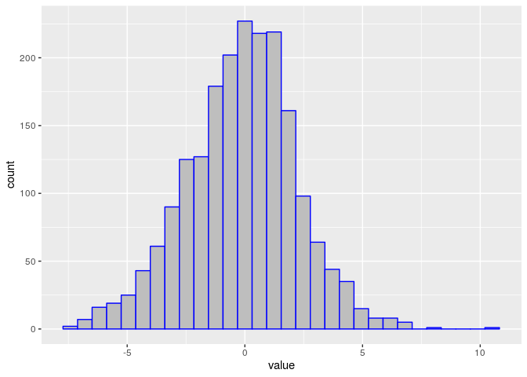
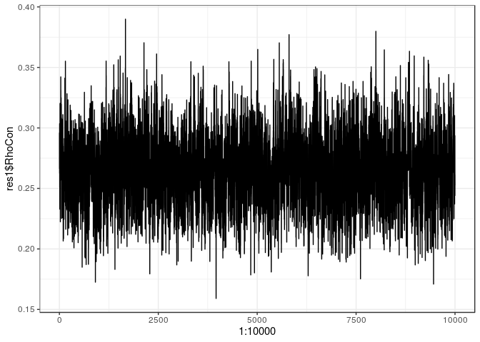
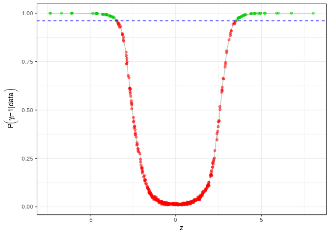
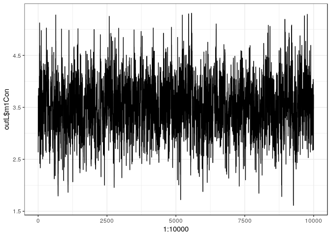
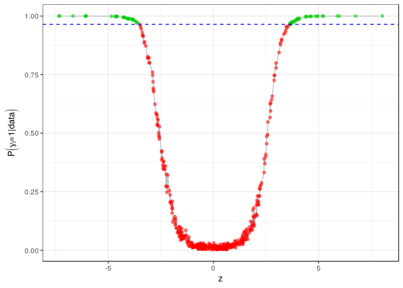
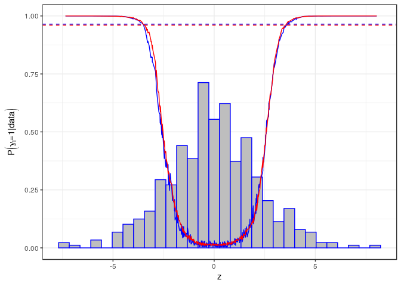

## Two-group Poisson-Dirichlet mixtures for multiple testing
## Tutorial 

In this tutorial we apply our methodology to a subsample of the `golub` dataset. The entire dataset can be found in the `multtest` package. The package can be installed and loaded with the following lines:

```r
source("https://bioconductor.org/biocLite.R")
biocLite("multtest")
require(multtest)
```

Let's take a look to the whole dataset: the `golub` table contains gene expression values from 3051 genes taken from 38 Leukemia patients. Twenty seven patients are diagnosed as acute lymphoblastic leukemia (ALL) and eleven as acute myeloid leukemia (AML). ([R Basics using Golub Data](https://rstudio-pubs-static.s3.amazonaws.com/187747_3eb3fc30ad7f4d8e92ad73520a0ff8f5.html)) 


```r
data(golub)
```

```r
head(golub[,1:7])
```

```
##          [,1]     [,2]     [,3]     [,4]     [,5]     [,6]     [,7]
## [1,] -1.45769 -1.39420 -1.42779 -1.40715 -1.42668 -1.21719 -1.37386
## [2,] -0.75161 -1.26278 -0.09052 -0.99596 -1.24245 -0.69242 -1.37386
## [3,]  0.45695 -0.09654  0.90325 -0.07194  0.03232  0.09713 -0.11978
## [4,]  3.13533  0.21415  2.08754  2.23467  0.93811  2.24089  3.36576
## [5,]  2.76569 -1.27045  1.60433  1.53182  1.63728  1.85697  3.01847
## [6,]  2.64342  1.01416  1.70477  1.63845 -0.36075  1.73451  3.36576
```

We compute the z-scores for the gene expressions. You can do it easily:

```r
teststat = mt.teststat(golub, golub.cl)
set.seed(1234)
index <- sample(length(teststat))
Z     <- teststat[index]
names <- golub.gnames[index, 2]
TT    <- tibble::enframe(Z,name = NULL)
ggplot(TT)+geom_histogram(aes(x=value),col=4,fill="gray")
```

<!-- -->

To obtain results in a timely manner, we load a subsample of 500 z-scores, contained in `golub_subs_500.RDS`.

```r
Z <- read.RDS("Example2PPDfiles/golub_subs_500.RDS")
```
We are now ready to apply the BNPTesting model. Let's set up the hyperpriors values...

```r
prior_par11 <- list(m0=0,   s0=1, 
                    m1=3,   V1=3, 
                    a1= 1, b1=1, 
                    a_rho=1,  b_rho=9,
                    theta0=1, theta1=1, 
                    sigma0=0.75, sigma1=0.1, # parameters of the process
                    a_0 = 5, b_0 = .2,
                    kappaNLP=3, s1=2)
```

...and run the model!


```r
res1 <- BNPtesting(NSIM = 10000, 
                  burn_in = 10000, 
                  thinning = 1, 
                  y= Z,                                          # data
                  prior_par = prior_par11, 
                  verbose = T,
                  verbose_step = 10, 
                  sed = i*100,
                  SM = .5,optThresh = .44,batch = 100)           # adaptive MH parameters
```

The model provides a list as output, containing the following elements:

+ ``Y``: the data 
+ ``prior_par``: the hyperparameters' values
+ ``m1con``: MCMC chain for the parameter $m_1$
+ ``LabCon``: $MCMC chain for the cluster membership of each observation (inside the respective process)
+ ``Rhocon``: MCMC chain for the parameter $\rho$
+ ``ZiCon``: MCMC chain for the indicator variable $\gamma_i$
+ ``Thetacon``: MCMC chain for $\vartheta_i$

The output class is `BNPTesting`.

For example:

```r
qplot(y=res1$RhoCon,x=1:10000, geom = "line")+theme_bw()
```

<!-- -->

The most interesting part is the Posterior Probaiblity of Inclusion in the alternative process (PPI). We classify each observation as relevant if its PPI is above a specified threshold. We choose the threshold controlling the Bayesian FDR (Newton, 2004). We can visualize the results using the `plot` function defined for the `BNPT2PDD` class. We finally derive the ranking of the relevant genes.


```r
plot(res1,TH=.01)
```
<!-- -->


# Split-Merge Sampler

When the size of the dataset at hand becomes large, it could be infeasible to fit a classical Polya Urn model because of 
To overcome this issue, we implement a Spli-Merge alternative for the sampler (see Dahl, 2005 and Dahl, 2007 and our Supplementary Material for more details).

We can adopt the same hyperprior values as before, and run the model with


```r
zz = Testing2PPD_SM(NSIM = nsim , 
                    burn_in = BI, 
                    thinning = 1, 
                    y= Z, 
                    prior_par = prior_par11,
                    verbose = T,
                    verbose_step = 10, 
                    sed = i*100,
                    SM = .5,
                    optThresh = .44,
                    batch = 100
                    #############################
                    densities = T, 
                    warmstart = T,
                    StartingSWEEP = 10,
                    SWEEPevery = 100,
                ) 
```
where `warmstart=T` selects a favorable starting point to explore the space of the partitions, `StartingSWEEP` defines the number of full Polya-Urn steps to be performed at the beginning to reach convergence faster, `SWEEPevery` is the frequency with a full Polya-Urn step is performed.
`SM_per_iteration` is the number of Split-Merge moves per iteration.

Again, the model provides a list as output, containing the following elements:

+ ``Y``: the data 
+ ``prior_par``: the hyperparameters' values
+ ``m1con``: MCMC chain for the parameter $m_1$
+ ``m1accrate``: the  acceptance rate for the MH step performed to sample $m_1$
+ ``Rhocon``: MCMC chain for the parameter $\rho$
+ ``mppi``: Posterior probability of inclusion in the alternative process, computed after the burn-in period
+ ``PostPred``: an optional matrix (obtained setting ``density=T``) with the posterior densities evalauted on a grid of points.
+ Elapsed time statistics

The output class is `BNPTestingSM`. We can plot the different chains. For example:

```r
qplot(y=out1$m1Con,x=1:10000, geom = "line")+theme_bw()
```

<!-- -->

Again, one can plot recover the posterio probabilities of inclusion in the alternative process.

```r
plot.BNPtestingSM(out1,.01)
```


<!-- -->


Lastly, it is interesting to compare the output of the two different implementations. We obtain:

<!-- -->

